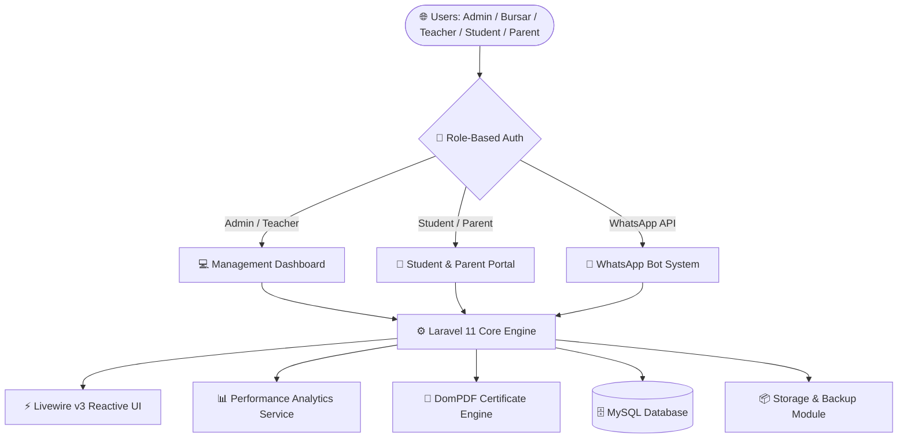

<div align="center">

  <!-- Header Banner -->
  

  <br/>

  <!-- Animated Typing Tagline -->
  <a href="https://github.com">
    
  </a>

  <br/><br/>

  <!-- Badges -->
  <p align="center">
    <a href="#-tech-stack"></a>
    <a href="#-tech-stack"></a>
    <a href="#-tech-stack"></a>
    <a href="#-tech-stack"></a>
    <a href="#-tech-stack"></a>
    <a href="#-whatsapp-bot"></a>
  </p>

  <!-- Quick Nav -->
  <p align="center">
    <a href="#-key-features"><b>🌟 Key Features</b></a> •
    <a href="#-system-architecture"><b>📐 Architecture</b></a> •
    <a href="#-roles--permissions-matrix"><b>🔐 Roles & Access</b></a> •
    <a href="#-quick-start--installation"><b>⚡ Quick Start</b></a>
  </p>

</div>


## 🚀 About AcademyHub

**AcademyHub** is a state-of-the-art, multi-tenant cloud School Management Platform built on **Laravel 11**, **Livewire v3**, and **Tailwind CSS**. Designed for modern educational institutions, AcademyHub streamlines administration, automates result computation, powers parent-school communication via an integrated **WhatsApp Bot**, and delivers rich real-time student performance analytics.

---

## 🌟 Key Features

<table>
  <tr>
    <td width="50%" valign="top">
      <h3>📊 Real-Time Analytics Engine</h3>
      <ul>
        <li><b>Performance Tracking:</b> Dynamic correlation between attendance, homework, CBT, and exam scores.</li>
        <li><b>Smart Insights:</b> Automatic identification of student strengths (🏆 70%+) and weaknesses (⚠️ &lt;60%).</li>
        <li><b>Trend Visualization:</b> Term-by-term comparative progress graphs.</li>
      </ul>
    </td>
    <td width="50%" valign="top">
      <h3>🤖 WhatsApp Bot Integration</h3>
      <ul>
        <li><b>Instant Results:</b> Parents can request report cards directly via WhatsApp.</li>
        <li><b>Automated Alerts:</b> Instant notifications for fee due dates, attendance, and announcements.</li>
        <li><b>24/7 Portal Access:</b> Automated chat menus for quick info retrieval.</li>
      </ul>
    </td>
  </tr>
  <tr>
    <td width="50%" valign="top">
      <h3>📄 PDF Report Cards & Certificates</h3>
      <ul>
        <li><b>Broadsheet Generation:</b> Automated term and session result computation.</li>
        <li><b>Custom Certificates:</b> High-resolution certificate generation powered by GD & DomPDF.</li>
        <li><b>QR Verification:</b> Instant digital verification for official documents.</li>
      </ul>
    </td>
    <td width="50%" valign="top">
      <h3>💳 Bursary & Finance Suite</h3>
      <ul>
        <li><b>Fee Management:</b> Track payments, outstanding balances, and discounts.</li>
        <li><b>Receipt Generation:</b> Automatic PDF payment receipts.</li>
        <li><b>Financial Reports:</b> Real-time cash flow & collection analytics for bursars.</li>
      </ul>
    </td>
  </tr>
  <tr>
    <td width="50%" valign="top">
      <h3>🏫 Student & Parent Portals</h3>
      <ul>
        <li><b>Dedicated Dashboards:</b> Tailored experience for students and parents.</li>
        <li><b>Homework Management:</b> Online submission and teacher feedback.</li>
        <li><b>Multi-Child Support:</b> Single parent account to manage all siblings.</li>
      </ul>
    </td>
    <td width="50%" valign="top">
      <h3>🛡️ One-Click Backup & Restore</h3>
      <ul>
        <li><b>Full System Snapshots:</b> Database SQL dump + <code>public/uploads</code> ZIP.</li>
        <li><b>Safe Maintenance Mode:</b> Automatic system locking during restore ops.</li>
        <li><b>Automated Backups:</b> Scheduled cloud and local backup routines.</li>
      </ul>
    </td>
  </tr>
</table>

---

## 📐 System Architecture



---

## 🔐 Roles & Permissions Matrix

| Role | Badge | Access Scope | Key Responsibilities |
| :--- | :---: | :--- | :--- |
| **Admin** |  | Global System & Settings | Full control, User Management, Backup/Restore, System Config |
| **Bursar** |  | Financial Modules | Fee collection, Receipts, Financial Audits, Debtors tracking |
| **Teacher** |  | Academic Modules | Score entry, Attendance, Broadsheets, Homework grading |
| **Student** |  | Personal Portal | Homework submission, Result checking, Attendance history |
| **Parent** |  | Children's Portal | Track performance, View fees, Report card downloads |

---

## 🛠️ Tech Stack

<p align="left">
  
  
  
  
  
  
  
  
  
</p>

---

## ⚡ Quick Start & Installation

### 📋 Prerequisites
- **PHP** `^8.2` (with GD extension enabled)
- **MySQL** `^5.7` or **MariaDB** `^10.3`
- **Node.js** `^18.0` & **NPM** / **pnpm**
- **Composer** `^2.0`

### 🔧 Step-by-Step Setup

```bash
# 1. Clone the repository
git clone https://github.com/your-org/academyhub.git
cd academyhub

# 2. Install PHP & Node dependencies
php composer.phar install
npm install

# 3. Configure environment file
cp .env.example .env
php artisan key:generate
```

<details>
<summary><b>🔍 View Required <code>.env</code> Configurations</b></summary>

```env
APP_NAME=AcademyHub
APP_ENV=production
APP_DEBUG=false
APP_URL=https://your-school-domain.com

DB_CONNECTION=mysql
DB_HOST=127.0.0.1
DB_PORT=3306
DB_DATABASE=academyhub
DB_USERNAME=root
DB_PASSWORD=your_secure_password

ACADEMYHUB_ADMIN_EMAIL=admin@academyhub.local
ACADEMYHUB_ADMIN_PASSWORD=your_admin_password
```
</details>

```bash
# 4. Run database migrations & seed demo data
php artisan migrate --force
php artisan db:seed --force

# 5. Build frontend assets
npm run build

# 6. Start local development server
php artisan serve
```

---

## 💾 Backup & Restore Guide

1. Navigate to **Settings** ➔ **Backup & Restore** in the Admin panel.
2. **Create Backup:** Click `Backup Now` to generate a full `.zip` snapshot containing:
   - Complete `database.sql` MySQL export
   - Uploaded assets from `public/uploads`
3. **Restore Backup:** Upload a previously exported `.zip` file. The system will automatically enter maintenance mode, verify file integrity, restore data, and re-enable services.

---

## 🤝 Support & Contribution

If you find this project helpful, please consider giving it a ⭐️ star on GitHub!

- 🐛 **Issue Tracker:** Report bugs or request features via GitHub Issues.
- 📧 **Support:** Contact the AcademyHub core team for Enterprise setup & customized deployments.


<div align="center">

  

  <p><b>© 2026 AcademyHub — Next-Gen Cloud School Management System</b></p>
  
</div>
